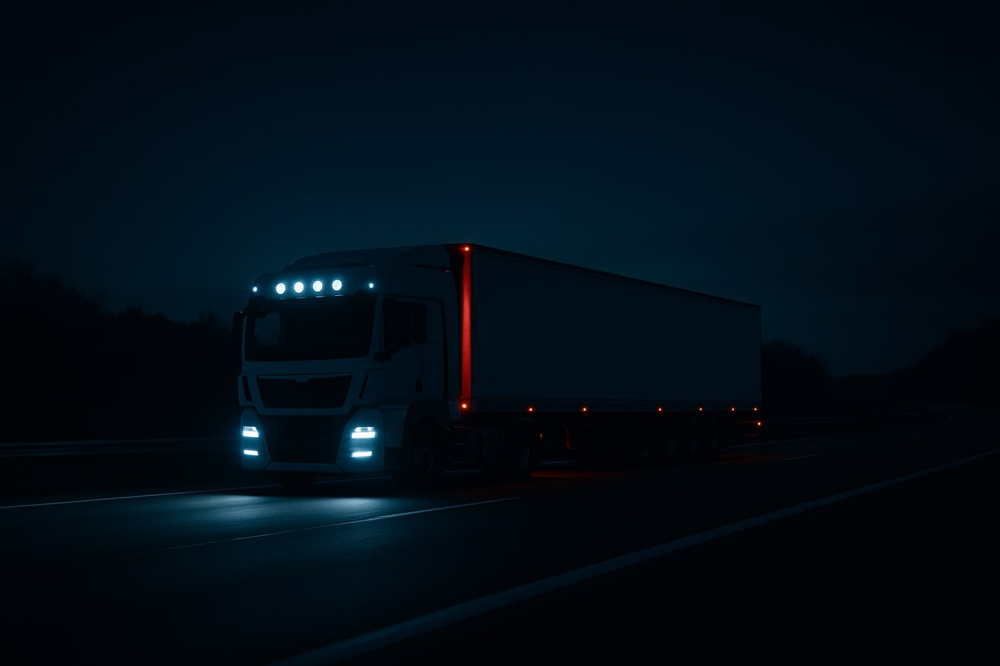

# Truck Image Implementation Guide

## 🚛 **How to Add the Truck Image to FreightIntelligence.ai**

### **Image Requirements**
- **Format**: JPG or PNG
- **Resolution**: 1920x1080 or higher
- **Theme**: Nighttime truck scene with dramatic lighting
- **Style**: Professional freight/logistics aesthetic

### **Implementation Steps**

#### **1. Save the Image**
Save your truck image with one of these names:
- `truck-hero.jpg` - For the hero section background
- `truck-network.jpg` - For the freight network section background  
- `truck-showcase.jpg` - For the truck showcase section background

#### **2. Place in Project Directory**
Put the image file in the same directory as `index.html`:
```
FreightIntelligence_ai/
├── index.html
├── styles.css
├── animations.js
├── truck-hero.jpg      ← Your truck image here
├── truck-network.jpg   ← Optional: Different image for network section
└── truck-showcase.jpg  ← Optional: Different image for showcase section
```

#### **3. Image Usage Locations**

**Hero Section Background:**
- The truck image will appear as a full-screen background behind the hero content
- Overlay gradient ensures text remains readable
- Creates dramatic, professional freight industry atmosphere

**Freight Network Section:**
- Subtle background image (10% opacity) behind the network visualization
- Reinforces freight industry theme without distracting from content

**Truck Showcase Section:**
- Dedicated section featuring the truck image prominently
- Includes truck-related statistics and messaging
- Perfect spot to highlight the professional freight aesthetic

### **CSS Customization**

If you want to adjust the image appearance, modify these CSS properties:

```css
/* Hero Section */
.hero::before {
  background-image: url('truck-hero.jpg');
  background-size: cover;        /* Adjust: cover, contain, 100% 100% */
  background-position: center;   /* Adjust: center, top, bottom, left, right */
  opacity: 1;                    /* Adjust: 0.1 to 1.0 for transparency */
}

/* Network Section */
.freight-network::before {
  background-image: url('truck-network.jpg');
  opacity: 0.1;                  /* Adjust: 0.05 to 0.3 for subtlety */
}

/* Showcase Section */
.truck-showcase::before {
  background-image: url('truck-showcase.jpg');
  opacity: 0.15;                 /* Adjust: 0.1 to 0.3 for visibility */
}
```

### **Alternative Implementation**

If you prefer to use the image as a regular `` tag instead of CSS background:

```html
<!-- Replace the placeholder in truck-showcase section -->
<div class="truck-showcase-image">
  
</div>
```

### **Performance Tips**

1. **Optimize Image Size**: Compress the image to reduce file size while maintaining quality
2. **Use WebP Format**: For better compression, convert to WebP format
3. **Responsive Images**: Consider using different image sizes for mobile devices

### **Current Status**

The platform is ready to display your truck image! Just add the image file and it will automatically appear in the designated sections. The placeholder sections will show a dashed border until you add the actual image.

### **Expected Result**

With the truck image implemented, you'll have:
- **Dramatic Hero Section**: Full-screen truck background with overlay text
- **Professional Aesthetic**: Reinforces freight industry credibility
- **Visual Impact**: Creates immediate connection to freight/logistics
- **Modern Design**: Maintains the sophisticated navy color scheme

The truck image will perfectly complement the existing freight icons and Terminal Industries-inspired design elements!


